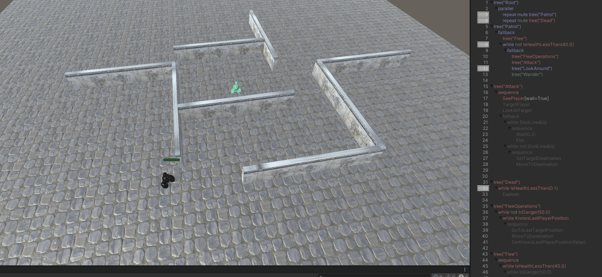

# Modificacion del proyecto RobotGuard - IA
## Autor: Álvaro González Rodríguez
alu0101202556

 * Modifica el proyecto de RobotGuard para hacer el que el NPC vuelva a la última posición donde vio al jugador antes de huir. Debe volver después de que su salud se haya recuperado por encima de 40.

Se han añadido 4 nuevas tareas en el archivo AI.cs. Dos de ellas sirven para almacenar la ubicación donde se encuentra el jugador antes de realizar ciertas operaciones, que comentaré más adelante, y para dirigirse a esa ubicación. Las otras dos administran un valor booleano para saber si el robot sabe la unicación hablada anteriormente

Luego podemos observar que se han añadido dos árboles nuevos en BotAI.BT

	tree("Flee")
		sequence
			while IsHealthLessThan(40.0)
				while InDanger(50.0)
					sequence
						SaveLastTargetPosition
						TakeCover
						MoveToDestination

El árbol "Flee" se ejecuta cada vez que el robot tenga sus puntos de salud por debajo de 40 puntos. Aqui se guarda la ubicación del jugador, se marca el valor booleano para tener en cuenta que la IA sabe la última ubicación antes de huir y finalmente escapa para buscar un sitio donde cubrirse.

	tree("FleeOperations")
		while not InDanger(50.0)
			while KnowsLastPlayerPosition
				sequence
					GoToLastTargetPosition
					MoveToDestination
					SetKnowsLastPlayerPosition(false)

En este árbol, la IA irá a la ubicación que almacenó en las operaciones de huida cuando ya no se encuentre en peligro. Una vez llegue a ella marcará el booleano como falso ya que en esta etapa el robot ya no sabe ni necesita esa última ubicación del jugador

Este es el resultado

